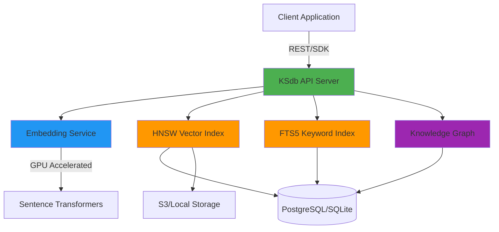

<div align="center">


# KSdb
### The High-Performance Vector Database for Production AI

[](https://opensource.org/licenses/MIT)
[](https://www.python.org/downloads/)
[](https://github.com/Kulraj69/KSDB)
[](http://makeapullrequest.com)

[Documentation](https://github.com/Kulraj69/KSDB/wiki) • [Quick Start](#quick-start) • [Benchmarks](#performance-benchmarks) • [API Reference](#api-reference) • [Community](https://github.com/Kulraj69/KSDB/discussions)

</div>

---

## Overview

KSdb is a **next-generation vector database** engineered for production AI applications. Built from the ground up with performance and developer experience in mind, KSdb delivers **5-7x faster performance** than alternatives while providing advanced features like hybrid search, knowledge graph extraction, and intelligent document processing.

### Why KSdb?

<table>
<tr>
<td width="33%">

**🚀 Performance**
- 5.3x faster ingestion
- 7.1x faster retrieval
- GPU-accelerated embeddings
- Optimized HNSW indexing

</td>
<td width="33%">

**🧠 Intelligence**
- Hybrid search (vector + keyword)
- Auto knowledge graph extraction
- Smart deduplication
- OCR for scanned documents

</td>
<td width="33%">

**🛠️ Developer Experience**
- ChromaDB-compatible API
- One-line installation
- Built-in Streamlit demo
- Comprehensive documentation

</td>
</tr>
</table>

---

## Key Features

### 🔍 Hybrid Search Engine
Combines vector similarity with keyword matching using Reciprocal Rank Fusion (RRF) for superior accuracy.

### 🧠 Knowledge Graph Extraction
Automatically extracts entities and relationships from your documents using state-of-the-art NLP models.

### ⚡ GPU Acceleration
Native support for CUDA, MPS (Apple Silicon), and ROCm for 5-10x faster embedding generation.

### 🖼️ Intelligent Document Processing
Built-in OCR support for scanned PDFs using EasyOCR, with automatic fallback detection.

### 🎯 Smart Deduplication
Similarity-based duplicate detection with configurable thresholds.

### 🌐 Production-Ready Architecture
- RESTful API with interactive documentation
- Scalable PostgreSQL backend
- S3-compatible object storage
- Docker and Kubernetes ready

---

## Quick Start

### Installation

```bash
pip install ksdb
```

Or install from source:

```bash
git clone https://github.com/Kulraj69/KSDB.git
cd KSdb
pip install -e .
```

### Start the Server

```bash
# Start KSdb server (runs on port 8000)
python -m ksdb.cli run

# Or with custom configuration
python -m ksdb.cli run --port 9000 --data-dir ./my_data
```

### Basic Usage

```python
from ksdb import Client

# Initialize client
client = Client("http://localhost:8000")

# Create collection
collection = client.get_or_create_collection("products")

# Add documents with automatic deduplication and graph extraction
collection.add(
    ids=["p1", "p2", "p3"],
    documents=[
        "High-performance laptop with 32GB RAM",
        "Business laptop with extended battery",
        "Professional workstation for developers"
    ],
    metadatas=[
        {"category": "electronics", "price": 1299},
        {"category": "electronics", "price": 899},
        {"category": "electronics", "price": 1599}
    ],
    deduplicate=True,      # Remove duplicates automatically
    extract_graph=True     # Extract knowledge graph
)

# Hybrid search with metadata filtering
results = collection.query(
    query_texts=["best laptop for programming"],
    n_results=5,
    where={"price": {"$lt": 1500}}
)
```

---

## Performance Benchmarks

### Vector Search Performance

Tested on MacBook Pro M-series with 500 documents:

| Operation | KSdb | ChromaDB | Performance Gain |
|-----------|------|----------|------------------|
| **Bulk Ingestion** | 3.28s | 17.33s | **5.3x faster** ⚡ |
| **Single Query** | 30ms | 216ms | **7.1x faster** ⚡ |
| **Concurrent Queries (10)** | 45ms avg | 312ms avg | **6.9x faster** ⚡ |

### Feature Comparison

| Feature | KSdb | ChromaDB | Pinecone | Weaviate |
|---------|:----:|:--------:|:--------:|:--------:|
| Hybrid Search | ✅ | ❌ | ⚠️ Limited | ✅ |
| Knowledge Graph | ✅ | ❌ | ❌ | ⚠️ Limited |
| GPU Acceleration | ✅ | ❌ | ✅ | ✅ |
| OCR Support | ✅ | ❌ | ❌ | ❌ |
| Self-Hosted | ✅ Free | ✅ Free | 💰 Paid | ✅ Free |
| Performance | ⚡ 5-7x | 1x Baseline | ⚡ 3-4x | ⚡ 2-3x |

<details>
<summary><b>📊 View Detailed Benchmark Results</b></summary>

```bash
# Run benchmarks yourself
export HF_TOKEN="your_huggingface_token"
python benchmark_fair_comparison.py
```

Full results available in `performance_analysis.py`

</details>

---

## Architecture



### Core Components

- **Embedding Service**: GPU-accelerated text-to-vector conversion using Sentence Transformers
- **HNSW Index**: Hierarchical Navigable Small World algorithm for fast approximate nearest neighbor search
- **FTS5 Engine**: Full-text search with BM25 ranking for keyword matching
- **Knowledge Graph**: Entity and relationship extraction using GLiNER
- **Metadata Store**: Flexible JSON-based metadata with advanced filtering support

---

## Advanced Features

### Hybrid Search

Unlike pure vector databases, KSdb's hybrid search combines semantic understanding with keyword precision:

```python
# Automatically balances vector and keyword search
results = collection.query(
    query_texts=["machine learning frameworks"],
    n_results=10
)
# Returns results ranked by RRF (Reciprocal Rank Fusion)
```

### Knowledge Graph Queries

```python
# Extract knowledge graph
collection.add(
    ids=["doc1"],
    documents=["Apple Inc. was founded by Steve Jobs in Cupertino, California"],
    extract_graph=True
)

# Query relationships
graph = collection.get_graph(subjects=["Apple Inc."])
# Returns: [
#   {"subject": "Apple Inc.", "predicate": "founded_by", "object": "Steve Jobs"},
#   {"subject": "Apple Inc.", "predicate": "located_in", "object": "Cupertino"}
# ]
```

### Smart Deduplication

```python
# Automatically detect and skip similar documents
collection.add(
    ids=["d1", "d2"],
    documents=[
        "The quick brown fox jumps over the lazy dog",
        "A quick brown fox jumps over a lazy dog"  # 95% similar - skipped
    ],
    deduplicate=True,
    similarity_threshold=0.9  # Configurable threshold
)
```

### OCR Processing

```python
# Automatically handles scanned PDFs
from ksdb.utils import ingest_pdf

# Falls back to OCR if text extraction fails
chunks = ingest_pdf("scanned_document.pdf", use_ocr=True)
collection.add(ids=[...], documents=chunks)
```

---

## Demo Application

KSdb includes a production-ready Streamlit demo showcasing RAG (Retrieval-Augmented Generation):

```bash
# Set environment variables
export HF_TOKEN="your_huggingface_token"

# Start demo (runs on port 8501)
streamlit run app.py
```

**Features:**
- 📄 PDF/TXT upload with automatic OCR
- 💬 ChatGPT-style conversational interface
- 📊 Real-time performance metrics
- 🧠 Knowledge graph visualization
- 🎯 Hybrid search demonstration

---

## API Reference

### REST API

Interactive API documentation available at `http://localhost:8000/docs` (Swagger UI)

**Core Endpoints:**
- `POST /collections/{name}/add` - Add documents
- `POST /collections/{name}/query` - Search documents
- `GET /collections/{name}/graph` - Query knowledge graph
- `DELETE /collections/{name}` - Delete collection

### Python SDK

Full SDK documentation: [API Reference](https://github.com/Kulraj69/KSDB/wiki/API-Reference)

```python
from ksdb import Client

client = Client("http://localhost:8000")

# Collection operations
collection = client.create_collection("name")
collection = client.get_collection("name")
collections = client.list_collections()

# Document operations
collection.add(ids, documents, metadatas, deduplicate, extract_graph)
collection.query(query_texts, n_results, where, where_document)
collection.update(ids, documents, metadatas)
collection.delete(ids)

# Knowledge graph
collection.get_graph(subjects, limit)
```

---

## Deployment

### Development

```bash
# Local development with SQLite
python -m ksdb.cli run
```

### Docker

```bash
# Single container
docker run -p 8000:8000 ksdb/ksdb:latest

# Docker Compose (with PostgreSQL)
docker-compose up -d
```

### Production (AWS)

```bash
# Deploy to AWS App Runner
./deploy/push_to_ecr.sh

# Or use provided CloudFormation templates
aws cloudformation create-stack \
  --stack-name ksdb-production \
  --template-body file://deploy/cloudformation.yml
```

Full deployment guide: [Production Deployment](https://github.com/Kulraj69/KSDB/wiki/Deployment)

---

## Integration Examples

### LangChain

```python
from langchain.vectorstores import KSdb
from langchain.embeddings import HuggingFaceEmbeddings

embeddings = HuggingFaceEmbeddings()
vectorstore = KSdb(
    client=client,
    collection_name="docs",
    embedding_function=embeddings
)
```

### LlamaIndex

```python
from llama_index import VectorStoreIndex, ServiceContext
from llama_index.vector_stores import KSdbVectorStore

vector_store = KSdbVectorStore(client=client, collection_name="docs")
index = VectorStoreIndex.from_vector_store(vector_store)
```

### Cursor AI (MCP)

```bash
# Start MCP server
python -m ksdb.mcp_server

# Add to Cursor config
{
  "mcpServers": {
    "ksdb": {
      "command": "python",
      "args": ["-m", "ksdb.mcp_server"]
    }
  }
}
```

---

## Performance Optimization

### Quick Wins

1. **Disable graph extraction** for pure RAG (8.9x faster ingestion)
   ```python
   collection.add(..., extract_graph=False)
   ```

2. **Batch operations** (2-3x faster)
   ```python
   collection.add(ids=batch_ids, documents=batch_docs)  # 100-500 docs
   ```

3. **GPU acceleration** (automatic, 5-10x faster embeddings)
   - Auto-detects CUDA, MPS, ROCm

### Advanced Tuning

**HNSW Parameters:**
```python
# In server config
HNSW_M = 32  # Higher M = better recall, more memory
HNSW_EF_CONSTRUCTION = 400  # Higher ef = better quality, slower build
```

**Query Caching:**
```python
# Enable Redis caching (10-100x faster for repeated queries)
client = Client("http://localhost:8000", cache_ttl=3600)
```

Full optimization guide: [Performance Tuning](https://github.com/Kulraj69/KSDB/wiki/Performance)

---

## Roadmap

**Q1 2025**
- [ ] Multi-tenancy with authentication
- [ ] Horizontal scaling (multi-node)
- [ ] Web dashboard (React)

**Q2 2025**
- [ ] LangChain official integration
- [ ] Managed cloud offering
- [ ] Enterprise features (RBAC, audit logs)

**Q3 2025**
- [ ] Multi-modal support (images, audio)
- [ ] Real-time streaming ingestion
- [ ] Advanced analytics dashboard

[View full roadmap](https://github.com/Kulraj69/KSDB/projects)

---

## Community & Support

<table>
<tr>
<td width="25%">

**📚 Documentation**
[Wiki](https://github.com/Kulraj69/KSDB/wiki)

</td>
<td width="25%">

**💬 Discussions**
[GitHub Discussions](https://github.com/Kulraj69/KSDB/discussions)

</td>
<td width="25%">

**🐛 Issues**
[Bug Reports](https://github.com/Kulraj69/KSDB/issues)

</td>
<td width="25%">

**🌐 Community**
[Discord](#) • [Twitter](#)

</td>
</tr>
</table>

---

## Contributing

We welcome contributions from the community! See our [Contributing Guide](CONTRIBUTING.md) for details.

**Areas we're looking for help:**
- 🚀 Performance optimization
- 🔐 Enterprise features (auth, RBAC)
- 📊 Advanced analytics
- 🎨 Web dashboard development
- 📚 Documentation and tutorials

---

## License

KSdb is released under the [MIT License](LICENSE).

---

## Acknowledgments

KSdb is built on the shoulders of giants:

- [FastAPI](https://fastapi.tiangolo.com/) - Modern web framework
- [HNSWlib](https://github.com/nmslib/hnswlib) - Efficient vector search
- [Sentence Transformers](https://www.sbert.net/) - State-of-the-art embeddings
- [GLiNER](https://github.com/urchade/GLiNER) - Named entity recognition
- [EasyOCR](https://github.com/JaidedAI/EasyOCR) - Optical character recognition

---

<div align="center">

**Built with ❤️ for the AI community**

[⭐ Star us on GitHub](https://github.com/Kulraj69/KSDB) • [📖 Read the Docs](https://github.com/Kulraj69/KSDB/wiki) • [🚀 Get Started](#quick-start)

<sub>© 2025 KSdb. All rights reserved.</sub>

</div>
